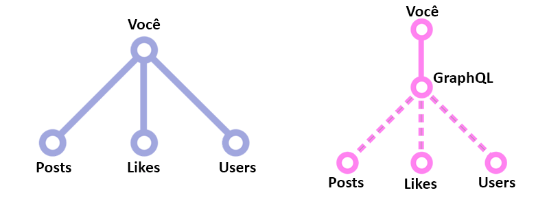

# GraphQL

É uma linguagem de consulta, assim como o SQL. Sua diferença é que o SQL é um padrão para bancos de dados, enquanto o GraphQL é um padrão para APIs.

Com o GraphQL podemos indicar ao servidor exatamente os campos que queremos em uma única requisição, até mesmo se os dados estiverem em lugares diferentes. Isso dá mais liberdade ao FrontEnd e poupa o BackEnd de ficar criando várias APIs.

## Origem

O GraphQL começou no Facebook. Eles começaram a usar em seus apps mobile em 2012. A primeira vez que o Facebook falou publicamente sobre o GraphQL foi na React.js Conf 2015, e depois anunciaram que o GraphQL teria seu código aberto.

## Por que usar?

Redução de quantidade de requisições e de dados trafegados principalmente para auxiliar dispositivos móveis.
Com o GraphQL podemos realizar queries diferentes para cada dispositivo, assim resultando nos dados realmente necessários, algo excelente para internets 3G ou 4G.

É muito comum tambem que, em sistemas maiores, os dados fiquem em diferentes bases de dados. Podemos, por exemplo, ter dados relacionais no MySQL, guardar certas informações em forma de documentos no MongoDB e ter pequenos dados para consultas rápidas no Redis.

É aqui que começamos a ver que teremos um bom trabalho: juntar dados de bancos diferentes e enviar uma estrutura diferente para cada tipo de aplicação.



Ao invés de ter que ficar criando uma API para cada estrutura diferente de dados e/ou ficar manualmente fazendo consultas para cada banco e depois juntar os dados, que tal simplesmente dizer a "alguém" o que você precisa? Apenas indique ao GraphQL o que você precisa e ele irá fazer todo o trabalho.

## Quem usa

Pode ser usado em qualquer lugar onde um cliente se comunica com uma API, seja web, desktop ou mobile.

* Coursera
* Facebook
* Github
* Meteor
* New York Times
* Pinterest
* Product Hunt
* Serverless
* Shopify
* Twitter
* Yelp

## FAQ

**Não gosto de ferramentas do Facebook**<br>
R: Existem ferramentas que realizam o mesmo que o GraphQL como o Falcor desenvolvida pela Netflix.

**Se eu for trabalhar com GraphQL, terei que usar React**<br>
R: Não

**A ideia do cliente dizer o que quer não me parece segura...**<br>
R: Fique tranquilo. O GraphQL tem uma coisa chamada resolvers. Com eles você pode cuidar da segurança de seus dados, permitindo ou não que determinado usuário acesse-os.

## Queries com GraphQL

### Criação do SDL (Schema Definition Language)

```node
type Pessoa{
  id: ID!
  nome: String!
  idade: Int!
  posts: [Post!]!
}

type Post{
  id: ID!
  titulo: String!
  autor: Pessoa!
}
```

* **type nomeDoTipo**:  Define um novo objeto que será utilizado;
* **! no final**: Define campo como obrigatório;
* **[nomeDoTipo]**: Define uma lista de nomeDoTipo;
* **[nomeDoTipo!]**: Evita que valores nulos seja adicionados a lista;
* **[nomeDoTipo!]!**: Evita que o campo venha nulo, resultando num array vazio.

### Query de consulta

```node
{
  allPessoas(first: 3){
    nome
    idade
    posts{
      titulo
    }
  }
}
```

* **Root Field**: Objetos principal da query de consulta;
* **Payloads**: São os campos do objeto;
* **all[nomeDoTipo]s**: Retorna todos os nomeDoTipo;
* **(first: 3)**: Parâmetros para query ao objeto adicionado, não precisam ser em ordem.

### Mutations

É utilizado para alteração de dados relacionados as ações CRUD, iniciando sempre com a palavra chave mutation.
Nas mutations são passados por parâmetros os valores a serem adicionados ao objeto (adicionados dentro dos parênteses), e quais dados serão retornados (dentro das chaves).

```node
mutation {
  createPessoa(idade: 25, nome: "Maria"){
    id
  }
}
```

### Subscription

Usado para receber alteração as informações que deseja observar, realizando assim uma conexão continua (tempo real) através de websockets, podendo observar todas as ações relacionadas ao CRUD. Por exemplo a subscription abaixo, onde a cada nova pessoa adicionada o GraphQL se encarregará de retornar o valor novo criado.

```node
subscription {
  newPessoa{
    id
    nome
    idade
  }
}
```

### Lado servidor

**Query serve como um contrato entre cliente e servidor, permitindo assim somente os campos que poderão ser consultados.**

```node
type Query{
  allPessoas(first: Int): [Pessoa!]!
}
```

**Query para mutations:**

```node
type Mutation{
  createPessoa(nome: String!, idade: Int!): Pessoa!
}
```

**Query para subscriptions:**

```node
type Subscription{
  newPessoa: Pessoa!
}
```

## O que é Graphcool

É um framework open-source que facilita o trabalho com GraphQL.

Podemos baixar o Graphcool e hospedá-lo em nosso próprio servidor ou tambem podemos aproveitar o serviço oferecido, que já disponibiliza uma plataforma completa com banco de dados.

Assim, ao criar uma aplicação, podemos focar inteiramente no Front End, pois o BackEnd com o Banco de Dados e APIs com GraphQL já estará pronto, sendo somente necessário criar o Schema.

### Como Instalar

```node
npm install -g graphcool
```

### Iniciando projeto com Graphcool

```node
graphcool-framework init
```

Caso ocorra algum erro, execute o comando abaixo:

```node
mkdit ~/.graphcool
```

### Realizando o deploy

```node
graphcool-framework deploy
```

### Abrir site do seu projeto

```node
graphcool-framework playground
```